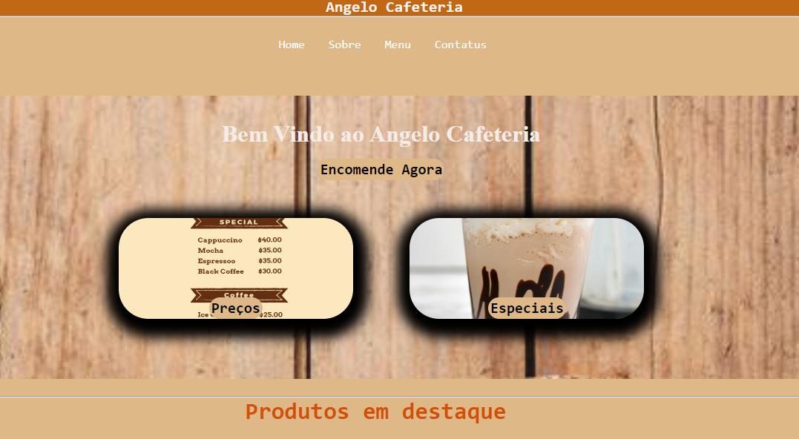

# descccrição do projeto
* Esse site foi criado para uma cafeteria aonde pessoas poden acessar e poder escolher seus pedidos e consultar o valor de cada produtos e suas variações.

# Tecnologias ultilizadas 🧑‍💻🧑‍💻

* HTML
* CSS
# 🛠️Feramentas ultilizadas🛠️ 🛠️

[EMOJI TERRA](https://emojiterra.com/hammer-and-wrench/) 

Autor: Nikollas 1a